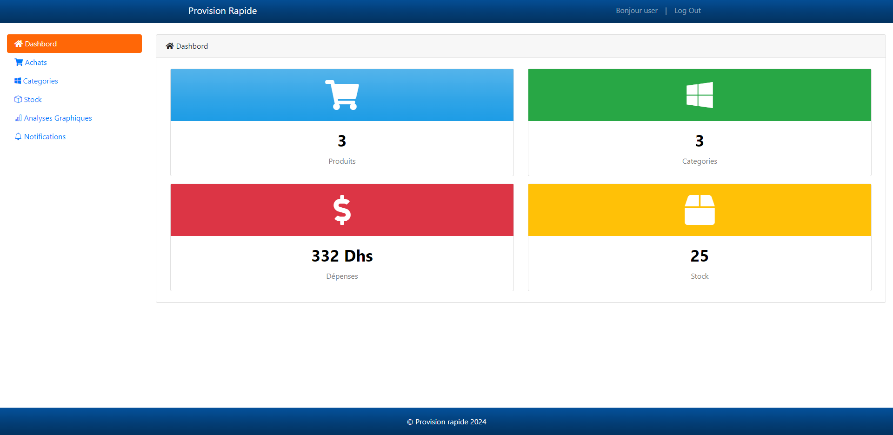

# Provision Rapide

Provision Rapide est une application web conçue pour la gestion de l'approvisionnement domestique. Elle permet aux utilisateurs de gérer leur stock domestique de manière efficace, avec des analyses graphiques et des notifications d'alerte.

## Fonctionnalités

- **Gestion de stock domestique** : Suivi et gestion de vos approvisionnements à la maison. 
- **Analyses graphiques** : Visualisation des données de stock avec des graphiques interactifs. 
- **Notifications d'alerte** : Recevez des alertes. 

## Technologies utilisées

- **Front-end** :
  - HTML 
  - CSS 
  - JavaScript 
  - Frameworks : 
    - Bootstrap 
    - jQuery 
    - Chart.js 

- **Back-end** :
  - PHP 

## Prérequis
Pour utiliser ce projet, vous aurez besoin de :

- Un serveur locale XAMPP (ou vien WAMP)
- Une base de données MySQL

## Installation
1. Téléchargez ou clonez le répertoire de ce projet sur votre ordinateur.
2. Placez le répertoire du projet dans le répertoire `htdocs` de votre environnement d'exécution PHP (XAMPP).
3. Importez le fichier cd `provisionrapide.sql` dans votre base de données MySQL.
4. Ouvrez votre navigateur web et accédez à l'application en saisissant l'URL `http://localhost/nom_du_répertoire_du_projet`.

## login
- **Adminisrateur** : 
    login: `admin@gmail.com` 
    password: `admin`
- **Utilisateur** : 
    login: `user@gmail.com` 
    password: `123`   

## License
This project is licensed under the MIT License. See the `LICENSE` file for more details.

## Contact
If you have any questions or feedback, feel free to reach out to me:

- 
- 
-    
